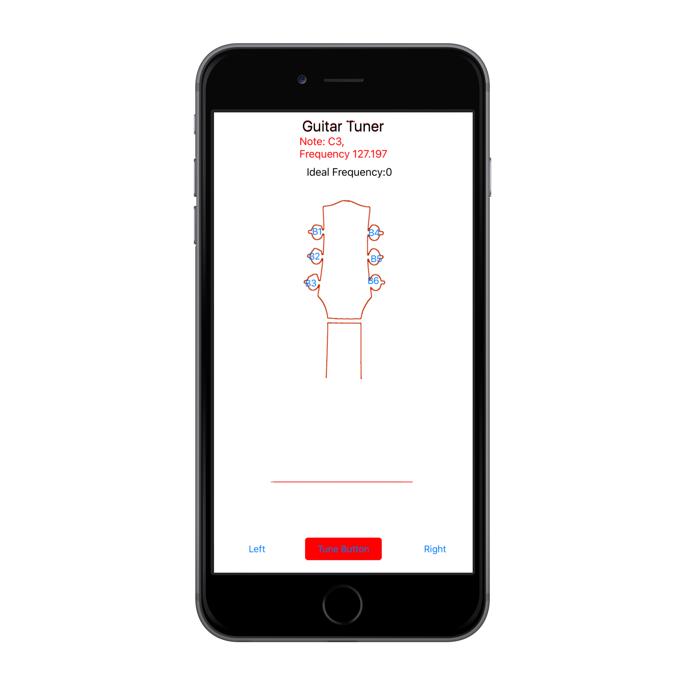
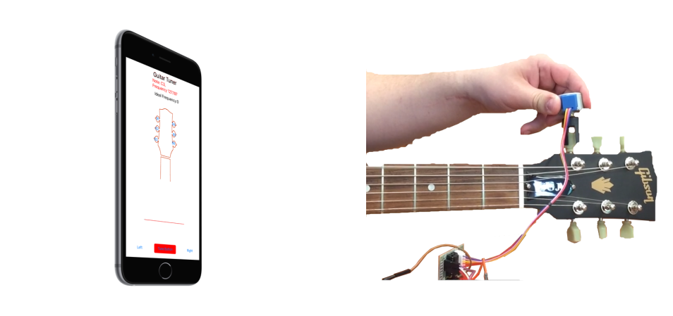

# Guitar_Tuning
Automatic Guitar Tuner made for a Electrical Engineering Design Project at Washington University. Tuner is controlled via an iOS app. Hardware built with an arduino and a stepper motor. 
### Layout

The app is pretty useless without the hardware. It all can be purchased for under $40(assuming you have access to a 3D printer).The components are:
### Neccesary Components
* Arduino Uno
* Tuner Clip ( .cad available in source)
* 3.5mm audio cable
* BYJ48 Stepper Motor
* ULN2300 Motor Driver
* IRF640 Transistor

